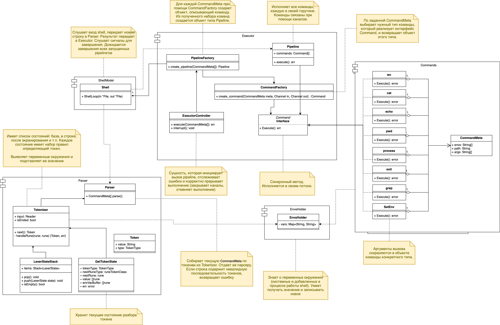
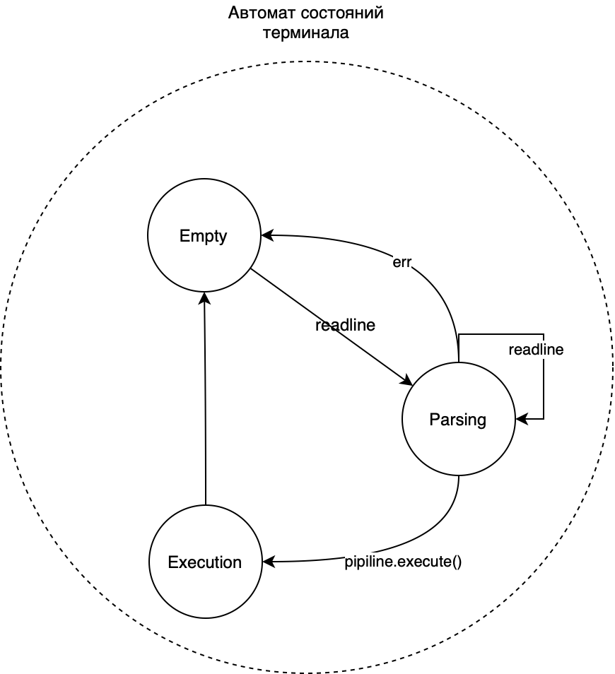

# Архитектурная документация

## Структурная диаграмма

## Язык реализации

Предлагается написать программу на языке **Go**. Причины, по которым был выбран этот язык:
- Встроенная поддержка параллелизма. Это позволяет удобно реализовать пайплайнинг, так как можно запускать команды асинхронно, и настроить взаимодействие между ними при помощи каналов/пайпов.
- Удобное управление группой запущенных горутин.
- Кроссплатформенность.

## Покомпонентное описание работы системы

---

### ShellModel

Это базовый компонент работы с пользователем. Event loop, который читает команды от пользователя из stdin. ShellModel отвечает за следующие задачи:
- Ожидание и получение строки от пользователя. Полученная строка перенаправляется на обработку Parser’у.
- Обработка результатов работы Parser:
- - Пока Parser не сообщил о том, что он закончил парсить команду, ShellModel посылает в него новые строки.
- - Если Parser завершил свою работу успешно, то полученный результат (объекты типа CommandMeta) посылает в Executor.
- - В случае возникновения ошибок в парсере, ShellModel выводит на экран пользователя ошибку и начинает ожидать новую строку.
- Перенаправление результатов работы Parser в Executor, а также обработка результатов работы Executor:
- - В случае ошибки выводится сообщение на экран пользователя.
- - В случае успеха ShellModel начинает ожидать новую строку.

Автомат состояний ShellModel:

---

### Parser

Строит пайп команд (представленные в виде command_meta.CommandMeta) на основе токенов, которые поступают от токенизатора. Команды собираются в порядке их последовательности, включая:

Аргументы (Args).
Переменные окружения процесса (Envs).
Имя команды (Name).
Логическую цепочку через пайпы (PipeToken).

Каждая команда завершается либо концом строки, либо eof.

### Tokenizer

Разбирает строки на распознаваемые парсером части – токены. 

Они представлены структурой Token с полями:
- TokenType — тип токена (слово, комментарий, символ переноса строки или pipe-разделитель).
- Value — строковое представление токена

**Конечный автомат токенизации**

Токенайзер использует конечный автомат, где каждое состояние (lexerState) отвечает за обработку символов в определённом контексте:

- startState — начальное состояние.
- inWordState — обработка последовательности символов, составляющих слово.
- escapingState — экранированный символ.
- quotingState, quotingEscapingState — внутри кавычек (с поддержкой/без поддержки экранирования).
- commentState — обработка комментария.
- enviromentVariableState — обработка переменных окружения.

Состояния помещаются в стек (statesStack), что позволяет возвращаться к исходному контексту (это нужно для обработки переменных окружения).

**Основной процесс токенизации**

- Публичный метод Next() возвращает следующий токен или ошибку. Он читает символы из входного потока, классифицирует их и вызывает handleRune для обработки.

- Во время разбора текущего токена есть у токенайзера есть поле типа getTokenState, отвечающее за текущее состояние разбора в нем хранится вся необходимая информация: предполагаемый тип токена, его содержимое, буффер для переменных окружения, ошибка.

- Метод handleRune() обрабатывает текущий символ, вызывая соответствующие методы (handleStartState, handleInWordState и прочие), которые зависят от состояния.

**Обработка кавычек**

По сути, кавычки допускают использование пробельных символов внутри токена слова (который может быть аргументом). 

|Аспект|Кавычки с экранированием (")|Кавычки без экранирования (')|
|----------|----------|----------|
|Состояние|quotingState|quotingEscapingState|
|Экранирование|Поддерживается|Не поддерживается.|
|Переменные окружения|Обрабатываются ($VAR).|Не обрабатываются, остаются как есть.|

**Обработка подстановок**

Обработка переменных окружения в токенизаторе происходит с использованием специального состояния enviromentVariableState и основана на символе $, который указывает на начало переменной окружения. Он состоит из нескольких шагов:

1. Распознавание переменной окружения. Когда токенизатор сталкивается с символом $ происходит переход в состояние enviromentVariableState.
2. Сбор имени переменной в буффер.
3. Замена идентификатора переменной на ее значение с помощью envsHolder.

Если идентификатора нет, будет подставлено пустое значение. Если идентификатор пустой, вернуть символ $.

**CommandMeta** – это структура, описывающая распознанную валидную команду интерпретатора.

---

### Executor

**Pipeline** – структура, которая содержит последовательность команд интерпретатора, соединенных пайпами. Каждая команда исполняется в своей горутине. Корректное завершение горутин в случае ошибки одной из них осуществляется при помощи инструментов языка Go и/или функциональности из различных пакетов.

**PipelineFactory** – фабрика Pipeline’ов, которая принимает последовательность CommandMeta, из которых при помощи CommandFactory создает последовательность команд. Провязывает ввод-вывод последовательных команд через пайпы. Каждая команда реализует интерфейс Command.

**CommandFactory** – фабрика команд, которая принимает описатели ввода-вывода и структуру CommandMeta, на основании которых создает экземпляр команды. Экземпляр команды абстрагируется в виде интерфейса Command.

**Command** – интерфейс исполняемой команды.

**ExecutorController** – структура, которая принимает набор структур типа CommandMeta, из которых при помощи PipelineFactory создает Pipeline и исполняет его. Код возврата после работы Pipeline возвращает в ShellFactory.

---
## Описание встроенных команд 

### 1. `wc`
- **Описание**: Считает количество строк, слов и байт в указанном файле.
- **Аргументы**: 
  - `[имя файла]` (опционально). Если не указан, работает с `stdin`.
- **Вывод**: Количество строк, слов и байт (и имя файла, если указано).

---

### 2. `cat`
- **Описание**: Выводит содержимое указанного файла.
- **Аргументы**: 
  - `[имя файла]` (опционально). Если не указан, работает с `stdin`.
- **Вывод**: Содержимое файла.

---

### 3. `echo`
- **Описание**: Выводит аргументы, разделённые пробелами.
- **Аргументы**: 
  - Список слов.
- **Вывод**: Слова, разделённые пробелами.

---

### 4. `pwd`
- **Описание**: Выводит текущую рабочую директорию.
- **Аргументы**: Нет.
- **Вывод**: Полный путь текущей директории.

---

### 5. `exit`
- **Описание**: Завершает работу интерпретатора.
- **Аргументы**: Нет.

---

### 6. `grep`
- **Описание**: Фильтрует строки из входного потока или файла, соответствующие регулярному выражению.
- **Аргументы**:
  - `-w`: Искать только полные слова.
  - `-i`: Игнорировать регистр.
  - `-A N`: Выводить дополнительные `N` строк после совпадения.
  - `[регулярное выражение]`: Строка для поиска.
  - `[имя файла]` (опционально). Если не указан, работает с `stdin`.
- **Вывод**: Отфильтрованные строки.

Библиотека для парсинга аргументов: github.com/jessevdk/go-flags

Почему была выбрана?
- Поддержка позиционных аргументов, флагов, опциональных и обязательных параметров.
- Аргументы и параметры описываются с помощью структур и тегов. Это делает код более читаемым и декларативным.
- Простота вызова: достаточно передать структуру с описанием аргументов.
- В случае ошибок парсинга (например, отсутствует обязательный флаг) автоматически выводится понятное сообщение об ошибке.
---

### 7. `cd`
- **Описание**: Меняет текущую рабочую директорию.
- **Аргументы**: 
  - `[имя директории]`.

---

### 8. `ls`
- **Описание**: Выводит содержимое текущей или указанной директории.
- **Аргументы**: 
  - `[имя директории]` (опционально).

---
