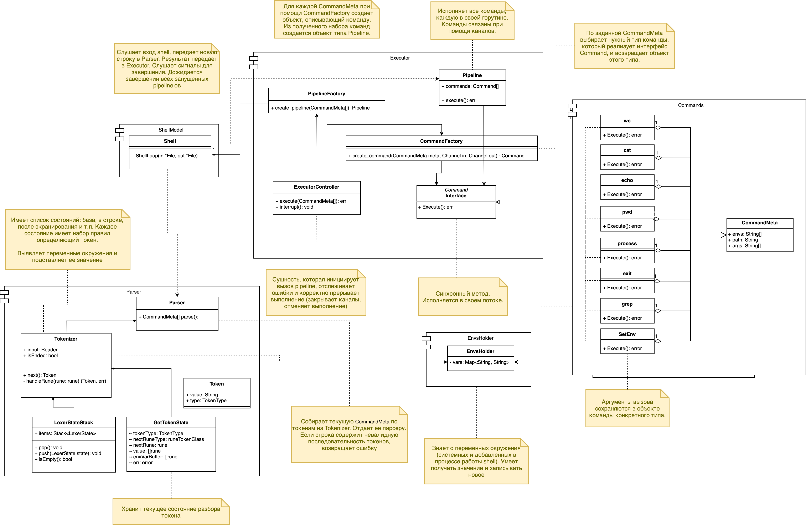

# Архитектурная документация

## Структурная диаграмма



## Язык реализации

Предлагается написать программу на языке **Go**. Причины, по которым был выбран этот язык:
- Встроенная поддержка параллелизма. Это позволяет удобно реализовать пайплайнинг, так как можно запускать команды асинхронно, и настроить взаимодействие между ними при помощи каналов/пайпов.
- Удобное управление группой запущенных горутин.
- Кроссплатформенность.


## Покомпонентное описание работы системы

---

### ShellModel 

Это базовый компонент работы с пользователем. Event loop, который читает команды от пользователя из stdin. ShellModel отвечает за следующие задачи:
- Ожидание и получение строки от пользователя. Полученная строка перенаправляется на обработку Parser’у.
- Обработка результатов работы Parser:
- - Пока Parser не сообщил о том, что он закончил парсить команду, ShellModel посылает в него новые строки.
- - Если Parser завершил свою работу успешно, то полученный результат (объекты типа CommandMeta) посылает в Executor.
- - В случае возникновения ошибок в парсере, ShellModel выводит на экран пользователя ошибку и начинает ожидать новую строку.
- Перенаправление результатов работы Parser в Executor, а также обработка результатов работы Executor:
- - В случае ошибки выводится сообщение на экран пользователя.
- - В случае успеха ShellModel начинает ожидать новую строку.

Автомат состояний ShellModel:


---

### Parser

**Tokenizer** часть компонента Parser. Это – сущность для разбора строки на распознаваемые части – токены. В каждый момент времени находится в одном из состояний, каждое из которых определяет свой набор правил для разбора. Tokenizer запрашивает новую строку у ShellModel; понимает, что строка была обработана, после того как интерпретатор получил перевод строки (символ ‘\n’) и находится в базовом состоянии, иначе запрашивает следующую.

Этот класс должен уметь выявлять env (с $ в начале) и подставлять его вместо переменной, продолжая парсить с его значением.

Предлагается использовать готовый пакет, в котором реализован Tokenizer: https://github.com/google/shlex.

Полученные токены забирает вторая часть компонента Parser – сущность Grammer, которая собирает CommandMeta из токенов и возвращает их ShellModel.

**CommandMeta** – это структура, описывающая распознанную валидную команду интерпретатора.

---

### Executor

**Pipeline** – структура, которая содержит последовательность команд интерпретатора, соединенных пайпами. Каждая команда исполняется в своей горутине. Корректное завершение горутин в случае ошибки одной из них осуществляется при помощи инструментов языка Go и/или функциональности из различных пакетов.

**PipelineFactory** – фабрика Pipeline’ов, которая принимает последовательность CommandMeta, из которых при помощи CommandFactory создает последовательность команд. Провязывает ввод-вывод последовательных команд через пайпы. Каждая команда реализует интерфейс Command.

**CommandFactory** – фабрика команд, которая принимает описатели ввода-вывода и структуру CommandMeta, на основании которых создает экземпляр команды. Экземпляр команды абстрагируется в виде интерфейса Command.

**Command** – интерфейс исполняемой команды.

**ExecutorController** – структура, которая принимает набор структур типа CommandMeta, из которых при помощи PipelineFactory создает Pipeline и исполняет его. Код возврата после работы Pipeline возвращает в ShellFactory.

---

## Правила грамматики языка интерпретатора

> Здесь будет не совсем формально описано то, какие команды считаются допустимыми в рамках нашего интерпретатора.

Обозначения:
- `{ X }`  означает “любое число объектов X (может и 0)”
- `( X or Y )` означает “либо объект X, либо объект Y”
- `[ X ]` означает “ноль или один объект X”

Правила:
```
<complete_cmd>  ::=  ( <pipeline> or <assignment> )<newline>
<pipeline>      ::=  <command> { '|' <command> }
<command>       ::=  <name> { <space_symbol> <arg> }
<space_symbol>  ::=  ( ‘ ’ or ‘\t’ )
<assignment>    ::=  <variable>=[ <value> ]
```

Уточнения:
- Все подстановки переменных окружения происходят до исполнения команды.
- Значение переменной окружения действительно до конца жизни интерпретатора.
- Если было несколько присваиваний одной и той же переменной, то будет записано последнее значение.
- Пробельные символы в операции присваивания между операндами и знаком ‘=’ запрещены.


