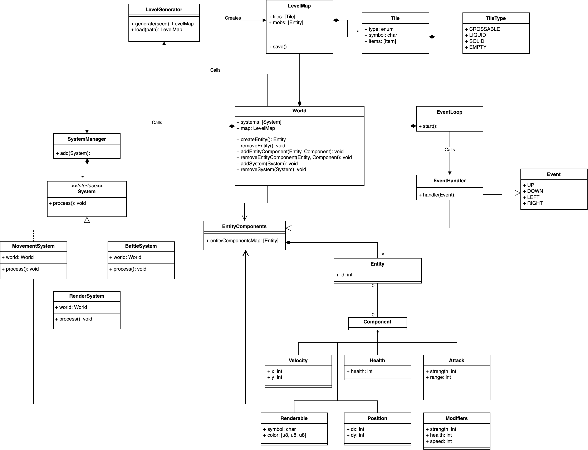

# **Архитектурное описание Roguelike**

## **Общие сведения о системе**

Roguelike — это консольная игра, построенная по классическим принципам жанра Roguelike: процедурно сгенерированные карты, пошаговое управление и управление персонажем игрока. При создании архитектуры были использваны такие паттерны как: Entity-Component-System (ECS) и Observer.

Для реализации предлагается использовать Python с использованием библиотек **pygame** для ввода и вывода, а также **esper** для регистрации событий и сущностей в системе. Такой выбор технологий обусловлен: простотой и скоростью разработки в условиях сжатых сроков, кроссплатформеностью и популярностью.

Основные особенности:
- Процедурная генерация карты с возможностью загрузки сохраненных уровней из файла.
- Управление игровым процессом через клавиатуру.
- Характеристики персонажа, изменяющиеся в зависимости от экипировки.
- Простая консольная графика в виде ASCII символов

---

## **Функциональные требования**
1. Карта генерируется процедурно, с возможностью загрузить готовую из файла.
2. Персонаж имеет базовые характеристики: здоровье, сила атаки, скорость.
3. Реализация инвентаря: персонаж может собирать предметы с карты, надевать и снимать их.
4. Надетые предметы изменяют характеристики персонажа.
5. Все предметы, находящиеся на карте, могут быть подобраны и перемещены в инвентарь.

## **Нефункциональные требования**
1. Игра отображается в консоли с использованием символов (например, `@` для игрока, `#` для стены).
2. Управление игровам процессом происходит через клавиатуру.
3. Поддержка частоты игрового цикла 30 Гц.

---

## **Роли и случаи использования**

### **Роли**
1. **Игрок**: Управляет персонажем, собирает предметы, надевает экипировку и взаимодействует с окружением.

### **Случаи использования**

1. Генерация карты
   - При старте игры карта генерируется процедурно или загружается из файла.
   - Области карты представляют различный ландшафт, проходимый или не проходимый для игрока (например земля, стены, вода)

2. Управление персонажем
   - Игрок использует клавиши для перемещения персонажа по карте, взаимодействия с предметами и врагами.

3. Предметы
   - Персонаж поднимает предметы с игровой карты, которые оказываются в его инвентаре.

4. Использование экипировки
   - Игрок надевает предметы, которые изменяют характеристики персонажа.

5. Снятие экипировки
   - Игрок снимает предметы, перемещая их обратно в инвентарь.

6. Взаимодействие с врагами
   - Персонаж может сражаться с врагами на основе характеристик.

---

## **Диаграмма классов**

1. **Компоненты сущностей (`Entity components`)**:
   - **Position**: Координаты объекта на карте.
   - **Renderable**: Символ, отображаемый на экране.
   - **Velocity**: Скорость движения объекта в виде вектора.
   - **Health**: Уровень здоровья сущности.
   - **Attack**: Сила атаки и радиус действия.
   - **Modifiers**: Изменения характеристик от надетой экипировки и подобранных предметов.

2. **Системы (`System`)**:
   - **MovementSystem**: Управляет перемещением сущностей.
   - **BattleSystem**: Обрабатывает боевые взаимодействия.
   - **RenderSystem**: Рисует карту и сущности на экране.

3. **Управляющий модуль (`World`)**:
   - Управляет системой и их процессингом.

4. **Карта (`LevelMap`)**:
   - Содержит тайлы и описание того, какие сущности находятся на тайлах.
   - Генерируется с помощью `LevelGenerator`.

5. **Тайл (`Tile`)**:
   - Единица игровой крты
   - Содержит описание поверхности, ее проходимости, объектов и предметов на ней

6. **Игровой цикл (`EventLoop`)**:
   - Управляет игровым процессом через обработку событий (например, нажатие клавиш) и таймер цикла.

Схема архитектуры:

---

## **Описание архитектуры**

### **Entity-Component System (ECS)**

Использование ECS позволяет отделить данные (компоненты) от логики (системы). Это обеспечивает модульность, гибкость и лёгкость тестирования. Позволяет избежать использования тяжелых объектно-ориентированных иерархий.

#### **Сущности (Entities)**
Сущности — это уникальные идентификаторы, представляющие игровые объекты (например, игрок, враги, предметы). Являются композицией набора компонентов.

#### **Компоненты (Components)**
Компоненты представляют собой данные, которые описывают свойства сущностей. Например:
- **Position**: Координаты объекта на карте.
- **Health**: Количество здоровья сущности.

#### **Системы (Systems)**
Системы содержат логику, которая применяется к сущностям с определённым набором компонентов. Например:
- **MovementSystem**: Управляет перемещением сущностей.
- **RenderSystem**: Отображает состояние мира.

Взаимодействие с системами происходит при использовании паттерна Observer.

---