# **Архитектурное описание Roguelike**

## **Общие сведения о системе**

Roguelike — это консольная игра, построенная по классическим принципам жанра Roguelike: процедурно сгенерированные карты, пошаговое управление и управление персонажем игрока. При создании архитектуры были использваны такие паттерны как: Entity-Component-System (ECS) и Observer.

Для реализации предлагается использовать Go с использованием библиотеки **tcell** для ввода и вывода. Такой выбор технологий обусловлен: простотой и скоростью разработки в условиях сжатых сроков, кроссплатформенностью и популярностью.

Основные особенности:
- Процедурная генерация карты с возможностью загрузки сохраненных уровней из файла.
- Управление игровым процессом через клавиатуру.
- Характеристики персонажа, изменяющиеся в зависимости от экипировки.
- Простая консольная графика в виде ASCII символов
- Различные виды ботов с уникальным поведением и отображением на карте

### Виды ботов и их отображение на карте
- **Агрессивный бот**: активно атакует игрока, отображается символом `A`. Ищет путь до игрока используя bfs.
- **Пассивный бот**: не атакует игрока, отображается символом `P`.
- **Трусливый бот**: убегает от игрока, отображается символом `C`.

### Загрузка карты из файла
Карта может быть загружена из JSON файла, который содержит следующие характеристики:
- **location_id**: Идентификатор локации.
- **start_position**: Начальная позиция игрока на карте.
- **map_size**: Размер карты (ширина и высота).
- **enemies**: Список врагов на карте, каждый из которых имеет тип, позицию, здоровье и атаку.

Пример JSON файла для загрузки карты:
```json
{
    "location_id": "1",
    "start_position": {
        "x": 0,
        "y": 0
    },
    "map_size": {
        "height": 15,
        "width": 15
    },
    "enemies": [
        { "type": "passive", "pos": { "x": 0, "y": 3 }, "health": 100, "attack": 1 },
        { "type": "cowardly", "range": 5, "pos": { "x": 0, "y": 7 }, "health": 100, "attack": 100 },
        { "type": "aggressive", "range": 5, "pos": { "x": 0, "y": 9 }, "health": 100, "attack": 1 }
    ]
}
```

### Начисление опыта и повышение уровня
- **Начисление опыта**: Персонаж получает опыт за победу над врагами. Когда враг побежден, персонаж получает фиксированное количество очков опыта.
- **Повышение уровня**: Когда количество опыта достигает определенного порога (уровень * 10), уровень персонажа повышается. При повышении уровня:
  - Увеличивается максимальное здоровье персонажа на 10 единиц.
  - Увеличивается текущий уровень персонажа.

---

## **Функциональные требования**
1. Карта генерируется процедурно, с возможностью загрузить готовую из файла.
2. Персонаж имеет базовые характеристики: здоровье и сила атаки.
3. Реализация инвентаря: персонаж может собирать предметы с карты, надевать и снимать их.
4. Надетые предметы изменяют характеристики персонажа.
5. Все предметы, находящиеся на карте, могут быть подобраны и перемещены в инвентарь.


## **Нефункциональные требования**
1. Игра отображается в консоли с использованием символов (например, `@` для игрока, `#` для стены).
2. Управление игровам процессом происходит через клавиатуру.
3. Поддержка частоты игрового цикла 30 Гц.

---

## **Роли и случаи использования**

### **Роли**
1. **Игрок**: Управляет персонажем, собирает предметы, надевает экипировку и взаимодействует с окружением.

### **Случаи использования**

1. Генерация карты
   - При старте игры карта генерируется процедурно или загружается из файла.
   - Области карты представляют различный ландшафт, проходимый или не проходимый для игрока (например земля, стены, вода)

2. Управление персонажем
   - Игрок использует клавиши для перемещения персонажа по карте, взаимодействия с предметами и врагами.

3. Предметы
   - Персонаж поднимает предметы с игровой карты, которые оказываются в его инвентаре.

4. Использование экипировки
   - Игрок надевает предметы, которые изменяют характеристики персонажа.

5. Снятие экипировки
   - Игрок снимает предметы, перемещая их обратно в инвентарь.

6. Взаимодействие с врагами
   - Персонаж может сражаться с врагами на основе характеристик.

---

## **Описание архитектуры**

### **Entity-Component System (ECS)**

Использование ECS позволяет отделить данные (компоненты) от логики (системы). Это обеспечивает модульность, гибкость и лёгкость тестирования. Позволяет избежать использования тяжелых объектно-ориентированных иерархий.

#### **Сущности (Entities)**
- Сущность представляет собой объект в игре, который может иметь различные компоненты.
- Сущности хранят свои компоненты и уникальный идентификатор.

#### **Компоненты (Components)**
Компоненты представляют собой данные, которые описывают свойства сущностей. Например:
- **Position**: Координаты объекта на карте.
- **Health**: Количество здоровья сущности.
- **Attack**: Количество урона, которое сущность может нанести в бою.
- **Movement**: Компонент перемещения, определяющий куда сущность хочет перейти за этот такт.
- **Texture**: Определяет как отображать сущность на карте.
- **Experience**: Текущий опыт персонажа и его уровень.
- **Fraction**: Компонент фракции, необходим для отличия противников от союзников.
- **Location**: Описывает стартовые параметры локации.
- **MobBehavior**: Копонент поведения бота, содержащий стратегию его поведения.

#### **Системы (Systems)**
Системы содержат логику, которая применяется к сущностям с определённым набором компонентов. Например:
- **MovementSystem**: Управляет перемещением сущностей.
- **RenderSystem**: Отображает состояние интерфейса.
- **InputSystem**: Обрабатывает ввод с клавиатуры.
- **CollisionSystem**: Определяет пересечение двух сущностей на карте.
- **ExperienceSystem**: Начисляет опыт и повышает уровень персонажа.
- **MobsBehaviorSystem**: Обрабатывает поведение мобов.

Эта диаграмма классов описывает основные компоненты паттерна ECS и их взаимодействие. Сущности (Entity) содержат компоненты (Component), которые представляют данные. Системы (System) содержат логику, которая применяется к сущностям с определённым набором компонентов. Менеджеры сущностей (EntityManager) и систем (SystemManager) управляют коллекциями сущностей и систем соответственно. Движок (Engine) управляет жизненным циклом игры, вызывая методы Setup, Run, Teardown и Tick для всех систем

## **Диаграмма классов паттерна ECS**

```mermaid
classDiagram
    direction LR
    class Entity {
        +string Id
        +uint64 Masked
        +[]Component Components
        +Add(components ...Component)
        +Get(mask uint64) Component
        +Remove(mask uint64)
        +Mask() uint64
    }
    class Component {
        <<interface>>
        +Mask() uint64
    }
    class ComponentWithName {
        <<interface>>
        +Mask() uint64
        +Name() string
    }
    class System {
        <<interface>>
        +Setup()
        +Process(entityManager EntityManager) int
        +Teardown()
    }
    class EntityManager {
        <<interface>>
        +Add(entities ...*Entity)
        +Entities() []*Entity
        +FilterByMask(mask uint64) []*Entity
        +FilterByNames(names ...string) []*Entity
        +Get(id string) *Entity
        +Remove(entity *Entity)
    }
    class SystemManager {
        <<interface>>
        +Add(systems ...System)
        +Systems() []System
    }
    class Engine {
        <<interface>>
        +Run()
        +Setup()
        +Teardown()
        +Tick()
    }
    class defaultEntityManager {
        +[]*Entity entities
        +Add(entities ...*Entity)
        +Entities() []*Entity
        +FilterByMask(mask uint64) []*Entity
        +FilterByNames(names ...string) []*Entity
        +Get(id string) *Entity
        +Remove(entity *Entity)
    }
    class defaultSystemManager {
        +[]System systems
        +Add(systems ...System)
        +Systems() []System
    }
    class defaultEngine {
        +EntityManager entityManager
        +SystemManager systemManager
        +Run()
        +Setup()
        +Teardown()
        +Tick()
    }
    EntityManager <|-- defaultEntityManager
    SystemManager <|-- defaultSystemManager
    Engine <|-- defaultEngine
    Entity "1" *-- "many" Component
    Component <|-- ComponentWithName
    System "1" *-- "many" Entity
    defaultEngine "1" *-- "1" EntityManager
    defaultEngine "1" *-- "1" SystemManager
    EntityManager "1" *-- "many" Entity
    SystemManager "1" *-- "many" System
````
---

## Диаграмма исполнения

```mermaid
flowchart TD
    A[Start Game] --> B[Initialize Engine]
    B --> C[Setup Systems]
    C --> D[Run Game Loop]
    D --> E[Process Systems]
    F{StateEngineStop?}
    F -->|No| E
    F -->|Yes| G[Teardown Systems]
    G --> H[End Game]

    subgraph Game Loop
        E --> I[Process InputSystem]
        I --> J[Process MovementSystem]
        J --> K[Process CollisionSystem]
        K --> L[Process ExperienceSystem]
        L --> M[Process MobsBehaviorSystem]
        M --> N[Process RenderingSystem]
        N --> F
    end
    
```
---
## Диаграмма классов Roguelike c ECS

```mermaid
classDiagram
    direction LR

    class Entity {
        +string Id
        +uint64 Masked
        +[]Component Components
        +Add(components ...Component)
        +Get(mask uint64) Component
        +Remove(mask uint64)
        +Mask() uint64
    }

    class Component {
        <<interface>>
        +Mask() uint64
    }

    class ComponentWithName {
        <<interface>>
        +Mask() uint64
        +Name() string
    }

    class Position {
        +int X
        +int Y
        +Mask() uint64
    }

    class Health {
        +int Value
        +Mask() uint64
    }

    class Attack {
        +int Damage
        +Mask() uint64
    }

    class Movement {
        +Position Next
        +Mask() uint64
    }

    class Experience {
        +int Points
        +Mask() uint64
    }

    class MobBehavior {
        +MobStrategy Strategy
        +Mask() uint64
    }

    class MobStrategy {
        <<interface>>
        +Act(entity *ecs.Entity, em ecs.EntityManager)
    }

    class aggressiveEnemyStrategy {
        +int delayMillisec
        +time.Time previousStepTimestamp
        +Act(entity *ecs.Entity, em ecs.EntityManager)
    }

    class passiveStrategy {
        +Act(entity *ecs.Entity, em ecs.EntityManager)
    }

    class cowardEnemyStrategy {
        +int delayMillisec
        +time.Time previousStepTimestamp
        +Act(entity *ecs.Entity, em ecs.EntityManager)
    }

    class System {
        <<interface>>
        +Setup()
        +Process(entityManager EntityManager) int
        +Teardown()
    }

    class EntityManager {
        <<interface>>
        +Add(entities ...*Entity)
        +Entities() []*Entity
        +FilterByMask(mask uint64) []*Entity
        +FilterByNames(names ...string) []*Entity
        +Get(id string) *Entity
        +Remove(entity *Entity)
    }

    class SystemManager {
        <<interface>>
        +Add(systems ...System)
        +Systems() []System
    }

    class Engine {
        <<interface>>
        +Run()
        +Setup()
        +Teardown()
        +Tick()
    }

    class defaultEntityManager {
        +[]*Entity entities
        +Add(entities ...*Entity)
        +Entities() []*Entity
        +FilterByMask(mask uint64) []*Entity
        +FilterByNames(names ...string) []*Entity
        +Get(id string) *Entity
        +Remove(entity *Entity)
    }

    class defaultSystemManager {
        +[]System systems
        +Add(systems ...System)
        +Systems() []System
    }

    class defaultEngine {
        +EntityManager entityManager
        +SystemManager systemManager
        +Run()
        +Setup()
        +Teardown()
        +Tick()
    }

    class GameModel {
        <<interface>>
        +Run()
        +Stop()
    }

    class defaultGameModel {
        +Engine engine
        +tcell.Screen screen
        +Run()
        +Stop()
    }

    class GameBuilder {
        <<interface>>
        +SetLocation(location string)
        +BuildScreen()
        +BuildEngine()
        +GetResult() GameModel
    }

    class defaultGameBuilder {
        +components.Location location
        +int playerAttack
        +int playerHealth
        +tcell.Screen screen
        +Engine engine
        +EntityFactory entityFactory
        +WithPlayerAttack(attack int) *defaultGameBuilder
        +WithPlayerHealth(health int) *defaultGameBuilder
        +WithLocation(locationFilePath string) *defaultGameBuilder
        +BuildScreen()
        +BuildEngine()
        +GetResult() GameModel
    }

    class EntityFactory {
        <<interface>>
        +CreatePlayer(x, y int, health int, attack int) *Entity
        +CreateEnemy(entityId string, typeEnemy string, x, y int, health int, attack int) *Entity
    }

    class defaultEntityFactory {
        +CreatePlayer(x, y int, health int, attack int) *Entity
        +CreateEnemy(entityId string, typeEnemy string, x, y int, health int, attack int) *Entity
    }

    class InputHandler {
        <<interface>>
        +CanHandle(event *tcell.EventKey) bool
        +Handle(event *tcell.EventKey, em EntityManager) bool
    }

    class MoveHandler {
        +CanHandle(event *tcell.EventKey) bool
        +Handle(event *tcell.EventKey, em EntityManager) bool
    }

    class QuitHandler {
        +CanHandle(event *tcell.EventKey) bool
        +Handle(event *tcell.EventKey, em EntityManager) bool
    }

    class inputSystem {
        +tcell.Screen screen
        +chan tcell.Event eventChan
        +[]InputHandler inputHandlers
        +Process(em EntityManager) int
        +WithScreen(screen *tcell.Screen) *inputSystem
        +WithInputHandlers(handlers ...InputHandler) *inputSystem
        +Setup()
        +Teardown()
    }

    class CollisionHandler {
        <<interface>>
        +CanHandle(entity1, entity2 *Entity) bool
        +Handle(entity1, entity2 *Entity) bool
    }

    class AttackHandler {
        +CanHandle(entity1, entity2 *Entity) bool
        +Handle(entity1, entity2 *Entity) bool
    }

    class collisionSystem {
        +[]CollisionHandler handlers
        +Process(em EntityManager) int
        +WithHandlers(handlers ...CollisionHandler) *collisionSystem
        +Setup()
        +Teardown()
    }

    class movementSystem {
        +Process(em EntityManager) int
        +Setup()
        +Teardown()
    }

    class renderingSystem {
        +tcell.Screen screen
        +string title
        +Process(em EntityManager) int
        +WithScreen(screen *tcell.Screen) *renderingSystem
        +WithTitle(title string) *renderingSystem
        +Setup()
        +Teardown()
    }

    class mobsBehaviorSystem {
        +Process(em EntityManager) int
        +Setup()
        +Teardown()
    }

    class experienceSystem {
        +Process(em EntityManager) int
        +Setup()
        +Teardown()
    }

    EntityManager <|-- defaultEntityManager
    SystemManager <|-- defaultSystemManager
    Engine <|-- defaultEngine
    GameModel <|-- defaultGameModel
    GameBuilder <|-- defaultGameBuilder
    EntityFactory <|-- defaultEntityFactory
    InputHandler <|-- MoveHandler
    InputHandler <|-- QuitHandler
    CollisionHandler <|-- AttackHandler
    System <|-- inputSystem
    System <|-- collisionSystem
    System <|-- movementSystem
    System <|-- renderingSystem
    System <|-- mobsBehaviorSystem
    System <|-- experienceSystem
    Entity "1" *-- "many" Component
    Component <|-- ComponentWithName
    Component <|-- Position
    Component <|-- Health
    Component <|-- Attack
    Component <|-- Movement
    Component <|-- Experience
    Component <|-- MobBehavior
    MobBehavior "1" *-- "1" MobStrategy
    MobStrategy <|-- aggressiveEnemyStrategy
    MobStrategy <|-- passiveStrategy
    MobStrategy <|-- cowardEnemyStrategy
    System "1" *-- "many" Entity
    defaultEngine "1" *-- "1" EntityManager
    defaultEngine "1" *-- "1" SystemManager
    EntityManager "1" *-- "many" Entity
    SystemManager "1" *-- "many" System
    inputSystem "1" *-- "many" InputHandler
    collisionSystem "1" *-- "many" CollisionHandler
    defaultGameBuilder "1" *-- "1" EntityFactory
    defaultGameModel "1" *-- "1" Engine
    defaultGameBuilder "1" *-- "1" Engine
    defaultGameBuilder "1" *-- "1" GameModel
```

